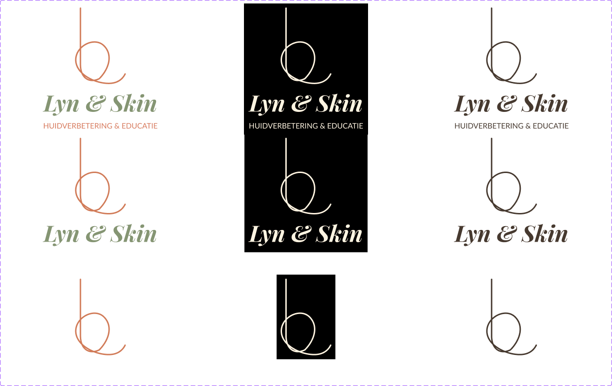
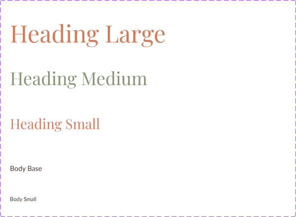
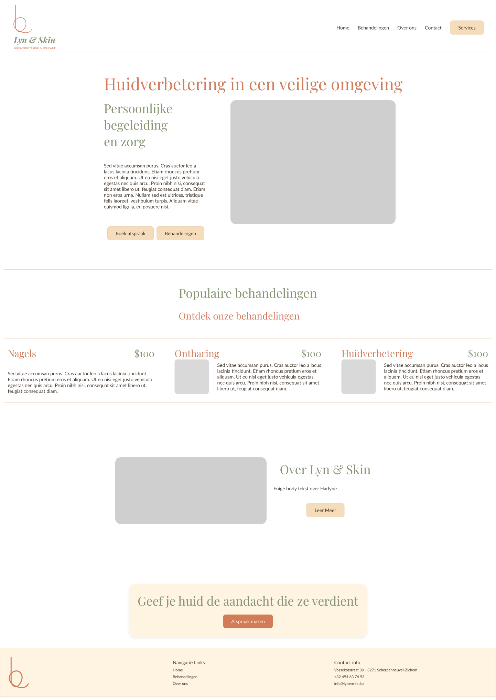
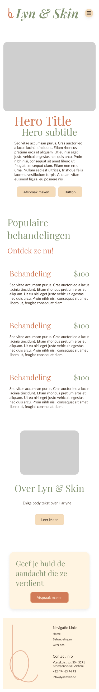
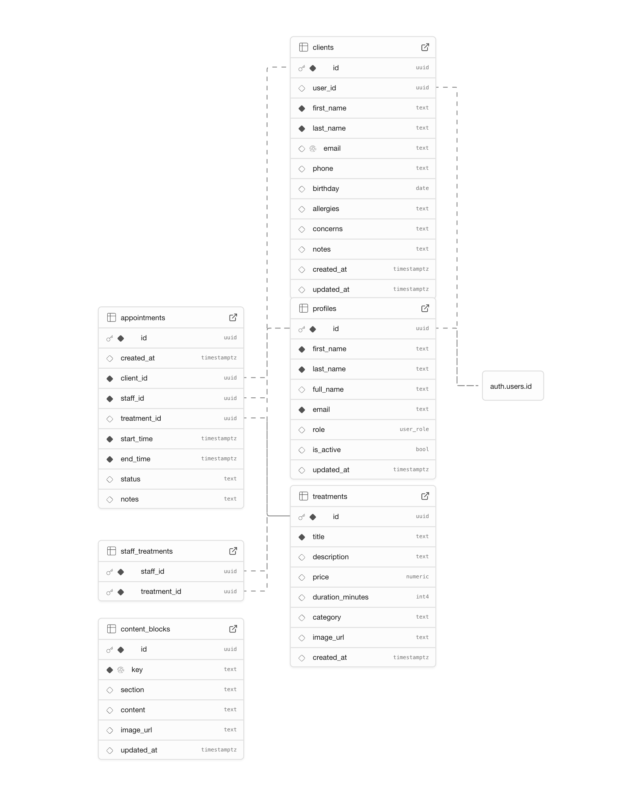

[toc]

# Project analyse

## Onderneming

| Klantgegevens |      |
| ------------ | ---- |
| Naam potentiële klant (persoon/bedrijf) |	Harlyne Timmermans - Lyn & Skin |
| Contactinformatie klant | E-mail: harlyne.timmermans@gmail.com  Telefoon: +32 494 63 74 93|

Lyn & Skin is het opstartende schoonheidssalon van Harlyne Timmermans, gespecialiseerd in professionele huidverbetering. Naast behandelingen zoals ontharingen met zowel suikerhars als gewone hars en nagelstyling, ligt er eveneens veel focus op educatie: klanten aanleren hoe ze zelf proactief voor hun huid kunnen zorgen. De kern van de onderneming is het creëren van een veilige, vertrouwde omgeving waar klanten volledig zichzelf kunnen zijn, zowel fysiek als mentaal.

## Marktonderzoek

### Sleutelwaarden en boodschap

De onderneming wil geassocieerd worden met expertise in huidverbetering, persoonlijke begeleiding, en 'well-being'. De centrale boodschap is het aanbieden van een veilige en ondersteunende omgeving voor zorg en zelfzorg. Harlyne acht het ook enorm belangrijk dat alle producten zelf getest zijn, en biedt dus enkel aan waar ze echt achter staat en in gelooft. 

### Concurrentie en onderscheid

- MiMomento huidstudio - https://www.mimomento.be/

  - __Meenemers__

    Geen, de site is hoogstwaarschijnlijk door de eigenares zelf gebouwd. Alle respect hiervoor.

  - __Vermijden__

    - Inconsistenties in de styling, waardoor sommige pagina's een laag contrast hebben.

- Beauty in Balance - https://www.beautyinbalance-zichem.com/

  - __Meenemers__
    - Routebeschrijving/Maps.

  - __Vermijden__
    - Alle text in cursive/italic
    - Te veel forms
    - Acties helemaal onderaan de pagina? 

- Schoonheidssalong Amaryllis - https://amaryllis-beauty.be/

  - __Meenemers__
    - Huisstijl is goed uitgewerkt.
    - Veel foto's en informatie

  - __Vermijden__
    - Cookies aanvaarden knop was niet goed aanklikbaar (z-index)
    - Popup over prijzen bij elke reload.

Lyn & Skin onderscheidt zich van de concurrentie door de begeleiding en educatie als onderdeel in haar aanpak, dit is uniek in de regio. Ook diepgaande productkennis is een grote troef. De grootste concurrentie gaat Amaryllis zijn, maar ook hier kan Harlyne op antwoorden - kleinschaliger is intiemer en laagdrempelig.

### Doel en doelgroep

<table>
  <tr>
    <td colspan="4">Plaats de letter P bij het primaire en de S bij de secundaire doelen.</td>
  </tr>
  <tr>
    <td>Informatief</td>
    <td></td>
    <td>Commercieel</td>
    <td>P</td>
  </tr>
  <tr>
    <td>Educatief</td>
    <td>S</td>
    <td>Entertainment</td>
    <td></td>
  </tr><tr>
    <td>Branding</td>
    <td>S</td>
    <td>Community</td>
    <td></td>
  </tr><tr>
    <td>Nieuws</td>
    <td></td>
    <td>Portfolio</td>
    <td></td>
</table>

<table>
  <tr>
    <td>Wat wil de klant met deze site <b>concreet</b> bereiken?</td>
    <td>Uitdragen van informatie is zeker een doel, maar Harlyne wil vooral een eerlijk en succesvol salon uit de grond stampen.</td>
  </tr>
  <tr>
    <td>Wanneer kan de klant over een successvolle website spreken? Waar ligt de lat?</td>
    <td>100 boekingen per maand</td>
  </tr><tr>
    <td>Beschrijf de primaire doelgroep van de onderneming</td>
    <td>De primaire doelgroep bestaat uit mensen hun huid willen verzorgen, willen ontharen of hun nagels willen laten verzorgen. Harlyne benadrukt hier wel dat medische problemen een doorverwijzing naar een medische specialist krijgen, dit vond ze wel enorm belangrijk.</td>
  </tr>
</table>
### Content en functionaliteit

#### Frontend content en functionaliteit

##### Epic 1: Afsprakenbeheer
* **Als bezoeker** wil ik de beschikbare data en tijden in een visuele kalender zien, zodat ik snel een passend moment kan vinden.
* **Als bezoeker** wil ik een behandeling selecteren en mijn gegevens invullen in een formulier, zodat ik een afspraak kan boeken.
* **Als klant** wil ik een duidelijke bevestiging op het scherm zien nadat ik een afspraak heb gemaakt, gewijzigd of geannuleerd.
* **Als klant** wil ik mijn afspraak kunnen annuleren of wijzigen via een link in mijn bevestigingsmail, zodat ik niet hoef te bellen.

##### Epic 2: Klantenbeheer (Account Systeem)

* **Als gebruiker** wil ik duidelijke registratie- en inlogformulieren kunnen gebruiken, zodat ik een account kan aanmaken of kan inloggen.
* **Als geregistreerde klant** wil ik een "Mijn Account" pagina zien met een overzicht van mijn vorige en toekomstige afspraken.

##### Epic 3: Website Informatie & Contact
* **Als bezoeker** wil ik een duidelijke pagina zien met een overzicht van alle behandelingen, hun prijzen en de duur.
* **Als bezoeker** wil ik een 'Over ons' pagina en de contactgegevens kunnen bekijken.
* **Als bezoeker** wil ik een contactformulier kunnen invullen en versturen, zodat ik een vraag kan stellen.

##### Functionaliteiten op basis van user stories
* **Afsprakenmodule:** Een interactieve kalender voor het boeken, wijzigen en annuleren van afspraken.
* **Klantenaccounts:** Gebruikersregistratie, inloggen, en een persoonlijk dashboard voor het beheren van afspraken.
* **Dynamische Informatiepagina's:** Pagina's voor behandelingen, prijzen en 'over ons' die beheerd worden vanuit de back-end.
* **Contactformulier:** Een standaardformulier om contact op te nemen met het salon.
* **Responsief Design:** De website is volledig bruikbaar op mobiele apparaten.

---

#### Backend functies en functionaliteit

##### Epic 1: Afsprakenbeheer (Admin)
* **Als Harlyne** wil ik een dashboard zien met de afspraken van vandaag, zodat ik direct een overzicht heb.
* **Als Harlyne** wil ik in een kalender-interface kunnen klikken op tijdblokken, zodat ik deze kan blokkeren voor vakanties of privézaken.
* **Als Harlyne** wil ik op een afspraak in de kalender kunnen klikken, zodat ik de details kan zien en deze kan wijzigen of annuleren.
* **Als Harlyne** wil ik dat het systeem automatisch bevestigings- en herinneringsmails verstuurt naar de klant.

##### Epic 2: Klantenbeheer (Admin)
* **Als Harlyne** wil ik een overzichtelijke lijst van al mijn klanten zien, zodat ik ze makkelijk kan terugvinden.
* **Als Harlyne** wil ik een klant kunnen selecteren en een detailpagina zien waar ik notities (zoals allergieën of productvoorkeuren) kan toevoegen of bewerken.

##### Epic 3: Content & Behandelbeheer (Admin)
* **Als Harlyne** wil ik in mijn admin-panel een overzicht zien van alle behandelingen, met knoppen om ze te bewerken of verwijderen.
* **Als Harlyne** wil ik een formulier kunnen gebruiken om een nieuwe behandeling met naam, prijs, duur en omschrijving toe te voegen.
* **Als Harlyne** wil ik een eenvoudige teksteditor kunnen gebruiken om de inhoud van pagina's zoals "Over ons" aan te passen.
* **Als Harlyne** wil ik een formulier zien waar ik mijn wekelijkse openingsuren kan instellen.

---

#### Sitemap frontend

* Home
* Behandelingen
    * Ontharing
    * Make-up
    * Verzorging
    * Massage
    * Pedicure
    * Manicure
    * Gel nagels
* Prijslijst
* Over ons
* Contact
* Afspraak Maken
* Mijn Account
    * Inloggen / Registreren
    * Dashboard (na inloggen)

---

#### Sitemap backend

* Login Pagina
* Dashboard (startpagina na inloggen met overzicht van de dag)
* Agenda (volledige kalenderweergave)
* Beheer
    * Behandelingen (overzicht, toevoegen, bewerken)
    * Klanten (overzicht, details bekijken, notities toevoegen)
    * Pagina's (inhoud van bv. 'Over ons' aanpassen)
* Instellingen
    * Openingsuren
* Uitloggen

### Grafisch en tekstmateriaal

Lyn & Skin heeft geen huisstijl of logo; voor de opdracht zal ik dit proberen te maken. Harlyne heeft een simpele schets uitgelegd; deze kan ik aanmaken in Affinity Designer. 

Voor de huisstijl, of toch de gewenste kleuren, heeft Harlyne me enkele moodboards bezorgd. Hier maak ik dan met Adobe Color of Coolors een palette aan.

De teksten zal Harlyne me aanleveren, dus de eerste draft gaat waarschijnlijk lorem ipsum bevatten.

### Kostenraming

Voor hosting opteren we voor Netlify of Vercel; beiden hebben een gratis tier en bieden meer dan voldoende zelfs al zou de site meer dan 1000 unique visitors krijgen. 

De backend gaat supabase (of firebase) worden, we nemen weer 1000 unique visitors. Ik ga er dan van uit dat we max 10k requests gaan maken, dus volstaat hier ook het gratis tier. Mocht het niet volstaan, is een kleine upgrade nodig. Dan komt de maandkost op 25EUR.

https://supabase.com/pricing

De domeinname 'lynenskin.be' zou het eerste jaar een \$4 kosten (one.com, combell.com,... ), daarna \$45 afhankelijk van welke provider we kiezen. Omdat de naam van het bedrijf nog niet set in stone is, gaat de domeinnaam niet geregistreerd worden en zal ik Harlyne tijdelijk een subdomain van mezelf geven.

### Kostenanalyse bij 100 Boekingen per Maand

| Dienst | Limiet Type | Gratis Limiet (per maand) | Verbruik (schatting) | Conclusie ✅/❌ |
| :--- | :--- | :--- | :--- | :--- |
| **Hosting**   (Vercel/Netlify) | **Bandbreedte** | 100 GB | **~15 GB**   (1.000 bezoekers x 15 MB) | ✅ Ruim binnen de limiet |
| **Backend**   (Supabase) | **API Requests** | N/A | **~10.000**   (100 boekingen x 100 requests) | ✅ Ruim binnen de limiet |
| | **Database Opslag**| 500 MB | **< 1 MB groei**   (100 boekingen + klanten) | ✅ Verwaarloosbaar verbruik |
| | **Gebruikers** | 50.000 | **100**   (100 nieuwe klanten) | ✅ Ruim binnen de limiet |

# Huisstijl

Dit hoofdstuk beschrijft de volledige huisstijl van de website die voor de klant wordt ontwikkeld. De stijl werd opgebouwd in overleg met de klant en volgt de principes van kleurenpsychologie, consistentie en toegankelijkheid.

De huisstijl bestaat uit:
	•	een kleurpalet
	•	lettertypes en hun rol
	•	een korte motivatie voor elke keuze
	•	duidelijke voorbeelden ter referentie

## Logo ontwikkeling

Het logo wordt in huiskleuren en monochrome versies voor donkere en lichte achtergronden weergegeven; ook wordt de grootte van het logo aangepast aan de functie op de pagina.

## Kleurenpalet

Het kleurensysteem is opgebouwd rond een warm, natuurlijk palet dat rust, zorg en authenticiteit uitstraalt. Elke kleur wordt hieronder beschreven met naam, exacte code (HSL), toepassing en motivatie.

<table style="border-collapse:collapse; width:100%; max-width:960px;">
  <thead>
    <tr>
      <th style="padding:8px; text-align:left;">Kleur</th>
      <th style="padding:8px; text-align:left;">Rol</th>
      <th style="padding:8px; text-align:left;">Betekenis</th>
    </tr>
  </thead>
  <tbody>
    <!-- Background -->
    <tr>
      <td style="padding:12px;">
        

          #FFF4E1 Background
        

      </td>
      <td style="padding:12px;">
        Algemene paginabackground en grote rustige vlakken.
      </td>
      <td style="padding:12px;">
        Warm, zacht en uitnodigend. Straalt rust en comfort uit. Perfect voor een natuurlijke en serene look.
      </td>
    </tr>
    <!-- Body -->
    <tr>
      <td style="padding:12px;">
        

          #46392F Body
        

      </td>
      <td style="padding:12px;">
        Standaard tekstkleur voor optimale leesbaarheid.
      </td>
      <td style="padding:12px;">
        Donker aardetint, warm en minder hard dan zwart. Straalt betrouwbaarheid en stabiliteit uit.
      </td>
    </tr>
    <!-- Primary -->
    <tr>
      <td style="padding:12px;">
        

          #D17B58 Primary
        

      </td>
      <td style="padding:12px;">
        Primaire knoppen, call-to-actions, belangrijkste accenten.
      </td>
      <td style="padding:12px;">
        Warme terracotta tint. Energie, menselijkheid en zachtheid zonder agressie.
      </td>
    </tr>
    <!-- Secondary -->
    <tr>
      <td style="padding:12px;">
        

          #859573 Secondary
        

      </td>
      <td style="padding:12px;">
        Secundaire knoppen en ondersteunende UI-elementen.
      </td>
      <td style="padding:12px;">
        Groen staat voor natuur, balans en herstel. Perfect voor ondersteunende accenten.
      </td>
    </tr>
    <!-- Accent -->
    <tr>
      <td style="padding:12px;">
        

          #D87C5F Accent
        

      </td>
      <td style="padding:12px;">
        Kleine accenten, badges, hover-effecten.
      </td>
      <td style="padding:12px;">
        Zachte terracotta-variant voor nuance en warmte zonder te overheersen.
      </td>
    </tr>
    <!-- Muted -->
    <tr>
      <td style="padding:12px;">
        

          #F5DCBA Muted
        

      </td>
      <td style="padding:12px;">
        Achtergronden voor rustige secties of minder prominente elementen.
      </td>
      <td style="padding:12px;">
        Warme beige tint — zachtheid, rust en toegankelijkheid.
      </td>
    </tr>
    <!-- Destructive -->
    <tr>
      <td style="padding:12px;">
        

          #C55546 Destructive
        

      </td>
      <td style="padding:12px;">
        Verwijderacties, foutmeldingen en waarschuwingen.
      </td>
      <td style="padding:12px;">
        Warm rood dat urgentie aangeeft zonder te fel of schreeuwerig te zijn.
      </td>
    </tr>
    <!-- Borders -->
    <tr>
      <td style="padding:12px;">
        

          #E9D3BA Borders
        

      </td>
      <td style="padding:12px;">
        Randen van kaarten, formulieren en UI-elementen.
      </td>
      <td style="padding:12px;">
        Neutrale, zachte lijnkleur die structuur brengt zonder visueel lawaai.
      </td>
    </tr>
  </tbody>
</table>

## Typografie

<table style="border-collapse:collapse; width:100%; max-width:960px;">
  <thead>
    <tr>
      <th style="padding:8px; text-align:left;">Lettertype & voorbeeld</th>
      <th style="padding:8px; text-align:left;">Rol</th>
      <th style="padding:8px; text-align:left;">Motivatie</th>
    </tr>
  </thead>
  <tbody>
    <tr>
      <td style="padding:12px;">
        

          Playfair Display – “Huidverbetering met aandacht”
        

      </td>
      <td style="padding:8px; vertical-align:top;">
        Primaire heading-font. 
        Gebruikt voor hero-titels, paginatitels en belangrijke sectietitels.
      </td>
      <td style="padding:8px; vertical-align:top;">
        Klassiek en elegant, met een redactionele uitstraling. De hoge contrasten geven een luxe, verzorgde indruk,
        wat goed past bij zorg, kwaliteit en expertise. Ideaal om belangrijke boodschappen eruit te laten springen.
      </td>
    </tr>
    <tr>
      <td style="padding:12px;">
        

          Lato – “Professionele huidverzorging op maat van elke klant.”
        

      </td>
      <td style="padding:8px; vertical-align:top;">
        Body- en UI-font. 
        Gebruikt voor paragrafen, formulieren, knoppen, navigatie en langere teksten.
      </td>
      <td style="padding:8px; vertical-align:top;">
        Moderne, zeer goed leesbare sans-serif die op alle schermformaten helder blijft.
        De neutrale vormgeving ondersteunt de elegante headings zonder ermee te concurreren
        en zorgt voor een professioneel, toegankelijk gevoel.
      </td>
    </tr>
  </tbody>
</table>

# Prototype front-end

# Analyse back-end

Ik heb een vrij basis EER diagram opgesteld; op basis van feedback van Harlyne. Zij vindt het belangrijk om degelijke klantenprofielen te hebben - en ging nog eens denken of ze extra features wou. Deze EER is een reflectie van de basis ze wou. 

# SEO Strategie

Om de doelstelling van 100 boekingen per maand te behalen, is vindbaarheid essentieel. Voor Lyn & Skin focust de SEO-strategie zich op drie pijlers: Technische SEO (de basis), On-Page SEO (de inhoud) en Lokale SEO (de regio).

## Technische SEO

Gezien de keuze voor moderne hosting (Vercel/Netlify), hebben we al een voorsprong op vlak van snelheid. De volgende technische vereisten worden geïmplementeerd:

- Core Web Vitals & Performance: De website wordt gehost op een CDN (Vercel/Netlify) voor snelle laadtijden (Time to First Byte).
- Afbeeldingen worden geconverteerd naar moderne formaten (WebP of AVIF) en krijgen loading="lazy" attributen om de Largest Contentful Paint (LCP) laag te houden d.m.v. (vert.sh)[https://vert.sh].
- Mobielvriendelijkheid: Aangezien veel klanten hun afspraken via de telefoon boeken, is de site 'Mobile First' ontworpen. Google hanteert Mobile-First Indexing, dus dit is cruciaal voor de ranking.
- Indexatie
	- Sitemap.xml: Een dynamisch gegenereerde sitemap die alle behandelpagina's bevat, wordt automatisch ingediend bij Google Search Console.
	- Robots.txt: Een correct ingesteld bestand dat crawlers toegang geeft tot de publieke pagina's, maar admin-routes (/admin, /dashboard) afschermt.
	- Structured Data (Schema.org):

- We implementeren LocalBusiness en BeautySalon schema markup. Hierdoor snappen zoekmachines direct wat de openingstijden, locatie, prijsrange en aangeboden diensten zijn. Dit vergroot de kans op Rich Snippets in de zoekresultaten.

## On-Page SEO (Content)
De content wordt geschreven met zowel de bezoeker als de zoekmachine in het achterhoofd.

- Zoekwoordenonderzoek
  - Focus op long-tail keywords met een lokale intentie.
  - Primair: "Huidverbetering [Regio]", "Suikerontharing [Regio]", "Nagelstudio [Regio]".
  - Secundair: "Natuurlijke huidverzorging", "Anti-aging behandeling".
- Meta Tags
  Elke pagina krijgt een unieke Title Tag (max 60 karakters) en Meta Description (max 160 karakters) die aanzet tot klikken (CTR).
  Voorbeeld Title: "Professionele Huidverbetering & Suikerontharing | Lyn & Skin"
- Semantische HTML
  Correct gebruik van `<h1>` (slechts één per pagina, bv. de naam van de behandeling), `<h2>` en `<h3>` om structuur aan te brengen.
- Interne Linkstructuur
  Vanuit de 'Behandelingen' overzichtspagina wordt gelinkt naar specifieke detailpagina's (bv. 'Gelaatsverzorging'). Dit helpt Google de hiërarchie van de site te begrijpen.

## Lokale SEO (Google Bedrijfsprofiel)
Omdat Lyn & Skin een fysieke locatie heeft, is dit de belangrijkste driver voor trafiek.

- Google Bedrijfsprofiel (GMB):
	- Er wordt een profiel geclaimd en volledig ingevuld (NAP-gegevens: Name, Address, Phone).
	- De categorie wordt ingesteld op "Schoonheidssalon" en "Huidverzorgingskliniek".

- Consistentie
	- De adresgegevens op de website (in de footer en op de contactpagina) moeten exact overeenkomen met die in Google Maps.

## Monitoring en Tools
Om de resultaten te meten worden de volgende tools gekoppeld:

- Google Search Console: Voor het monitoren van indexatie, zoekwoordenprestaties en technische fouten.

- Lighthouse: Wordt gebruikt tijdens development om te garanderen dat de Performance, Accessibility, Best Practices en SEO scores in het groen (90-100) blijven.

# Publicatie

# Product reflectie
